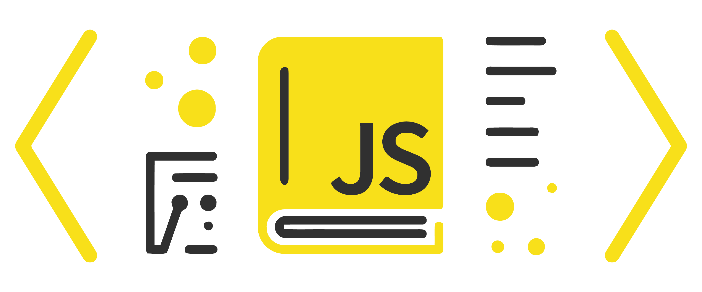
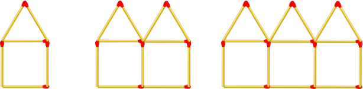
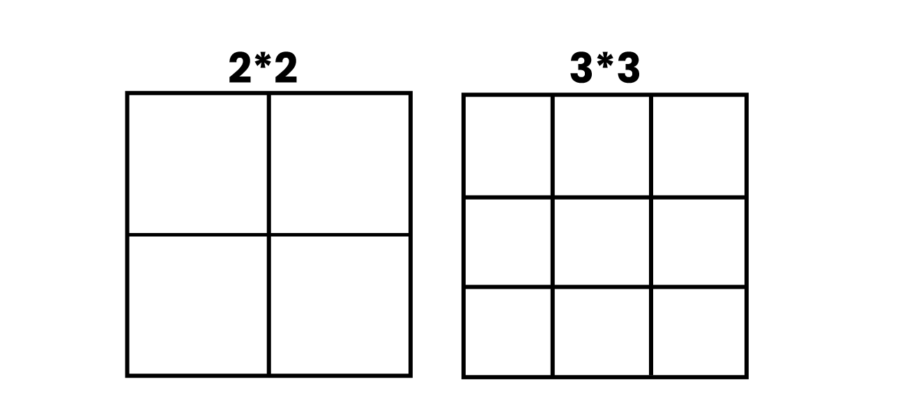
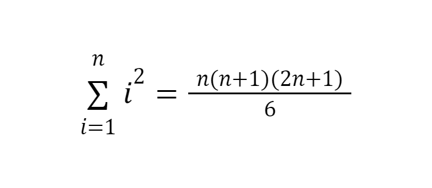

<h1 align="center" >JavaScript Coding Challenges </h1>


<div align="center" >

<a href="mailto:jahidulislamzim845@gmail.com">

</a>

<a href="tel:+8801780115943">

</a>
<a href="https://jahidulislamzim.netlify.app" target="_blank">

</a>
<a href="https://www.facebook.com/jahidulislamzim43" target="_blank">

</a>

<a href="https://www.linkedin.com/in/jahidulislamzim/" target="_blank">

</a>

<a href="https://github.com/jahidulislamzim" target="_blank">

</a>

</div>


##### 01. Creates a function that takes two numbers as arguments and return their sum.

```js
function addition(a, b) {
    //Write Your solution Here
};

console.log(addition(10, 20)); // 30
console.log(addition(30, 20)); // 50
console.log(addition(10, 90)); // 100

```

<details><summary style="cursor:pointer">Solution</summary>

```js
function addition(a, b) {
    let add = a + b;
    return (add)
};
```  

</details>

---
**[⬆ Back to Top](#header)**


##### 02. Converts hours into seconds.

```js

function howManySeconds(hours) {
    //Write Your solution Here
};


console.log(howManySeconds(12)); // 43200
console.log(howManySeconds(8)); // 28800
console.log(howManySeconds(3)); // 10800

```

<details><summary style="cursor:pointer">Solution</summary>

```js
function howManySeconds(hours) {
    let hoursToSeconds = (hours*3600);
    return(hoursToSeconds)
};
```  

</details>

---
**[⬆ Back to Top](#header)**


##### 03. Converts minutes into seconds.

```js

function convert(minutes){
    //Write Your solution Here
};


console.log(convert(30)); // 1800
console.log(convert(10)); // 600
console.log(convert(20)); // 1200

```

<details><summary style="cursor:pointer">Solution</summary>

```js
function convert(minutes) {
    let seconds = minutes*60;
    return (seconds)
};
```  

</details>

---
**[⬆ Back to Top](#header)**


##### 04. Calculates total points of a team from number of wins(3pts), draws(1pt), and losses(0pt).

```js

function footballPoints(wins, draws, losses){
    //Write Your solution Here
};


console.log(footballPoints(4, 3, 1)); // 15
console.log(footballPoints(10, 5, 0)); // 35
console.log(footballPoints(11, 0, 9)); // 33

```

<details><summary style="cursor:pointer">Solution</summary>

```js
function footballPoints(wins, draws, losses) {
    let points = (wins*3) + (draws*1) + (losses*0)
    return(points)
};
```  

</details>

---
**[⬆ Back to Top](#header)**


##### 05. Write functions to calculate the bitwise AND, bitwise OR and bitwise XOR of two numbers.

```js

function bitwiseAND(n1, n2) {
    //Write Your solution Here
};

function bitwiseOR(n1, n2) {
    //Write Your solution Here
};

function bitwiseXOR(n1, n2) {
    //Write Your solution Here
};


console.log(bitwiseAND(10, 20)); // 0
console.log(bitwiseOR(10, 20)); // 30
console.log(bitwiseXOR(10, 20)); // 30

```

<details><summary style="cursor:pointer">Solution</summary>

```js
function bitwiseAND(n1, n2) {
    let answer = n1 & n2;
    return (answer);
};

function bitwiseOR(n1, n2) {
    let answer = n1 | n2;
    return (answer);
};

function bitwiseXOR(n1, n2) {
    let answer = n1 ^ n2;
    return (answer);
};
```  

</details>

---
**[⬆ Back to Top](#header)**


##### 06. Write Function to return first value of an array.

```js
function getFirstValue(arr) {
      //Write Your solution Here
};


console.log(getFirstValue(["Saab", "Volvo", "BMW"])); // Saab
console.log(getFirstValue([3, 5, 1])); // 3
console.log(getFirstValue(['hello', 'world', 'welcome'])); // hello

```

<details><summary style="cursor:pointer">Solution</summary>

```js
function getFirstValue(arr) {
    return arr[0];
};
```  

</details>

---
**[⬆ Back to Top](#header)**


##### 07. Create a function that takes a number as an argument, increments the number by +1 and returns the result.

```js
function addition(num){
      //Write Your solution Here
};


console.log(addition(5)); // 6
console.log(addition(100)); // 101
console.log(addition(99)); // 100

```

<details><summary style="cursor:pointer">Solution</summary>

```js
function addition(num) {
    let numPlusOne = num + 1;
    return(numPlusOne)
};
```  

</details>

---
**[⬆ Back to Top](#header)**


##### 08. Given two numbers, return true if the sum of both numbers is less than 100. Otherwise return false.

```js
function lessThan100(a, b){
      //Write Your solution Here
};


console.log(lessThan100(10, 20)); // true
console.log(lessThan100(50, 60)); // false
console.log(lessThan100(20, 50)); // true

```

<details><summary style="cursor:pointer">Solution</summary>

```js
function lessThan100(a, b) {
    if (a + b < 100) {
        return true;
    }
    else {
        return false;
    }
};
```  

</details>

---
**[⬆ Back to Top](#header)**


##### 09. Create a function that returns true when num1 is equal to num2; otherwise return false.

```js
function isSameNum(num1, num2){
      //Write Your solution Here
};


console.log(isSameNum(30, 30)); // true
console.log(isSameNum(20, 40)); // false
console.log(isSameNum(50, 50)); // true

```

<details><summary style="cursor:pointer">Solution</summary>

```js
function isSameNum(num1, num2) {
    if (num1 === num2){
        return true;
    }
    else {
        return false;
    }
};
```  

</details>

---
**[⬆ Back to Top](#header)**


##### 10. Create a function that takes a number (step) as an argument and returns the amount of matchsticks in that step.

<div align="center">

</div>

```js
function matchHouses(step){
      //Write Your solution Here
};


console.log(matchHouses(5)); // 26
console.log(matchHouses(0)); // 0
console.log(matchHouses(10)); // 51

```

<details><summary style="cursor:pointer">Solution</summary>

```js
function matchHouses(step){
    if (step > 0) {
        let matchSticks = ((step*6) - (step -1));
    return(matchSticks)
    }
    else {
        let matchSticks = 0;
        return (matchSticks)
    }
};
```  

</details>

---
**[⬆ Back to Top](#header)**


##### 11. Write function to return the square of a number.

```js
function squared(a){
      //Write Your solution Here
};


console.log(squared(6)); // 36
console.log(squared(9)); // 81
console.log(squared(4)); // 16

```

<details><summary style="cursor:pointer">Solution</summary>

```js
function squared(a) {
    return (a*a);
};
```  

</details>

---
**[⬆ Back to Top](#header)**


##### 12. Write function to calculate Perimeter of Rectangles

```js
function findPerimeter(height, width){
      //Write Your solution Here
};


console.log(findPerimeter(20, 50)); // 140
console.log(findPerimeter(80, 30)); // 220
console.log(findPerimeter(10, 40)); // 100

```

<details><summary style="cursor:pointer">Solution</summary>

```js
function findPerimeter(height, width){
    let perimeter = 2*(height + width);
    return (perimeter)
};
```  

</details>

---
**[⬆ Back to Top](#header)**


##### 13. Add up all the numbers from 1 to the number you passed to the function.

```js
function addUp(num){
      //Write Your solution Here
};


console.log(addUp(10)); // 55
console.log(addUp(40)); // 820
console.log(addUp(15)); // 120

```

<details><summary style="cursor:pointer">Solution</summary>

```js
function addUp(num) {
    let sum = 0;
    for (i = 0; i <= num; i++){
        sum += i;
            }
    return(sum)
};
```  

</details>

---
**[⬆ Back to Top](#header)**


##### 14. Create a function that takes in three arguments (prob, prize, pay) and returns true if prob * prize > pay; otherwise return false.

```js
function profitableGamble(prob, prize, pay){
      //Write Your solution Here
};


console.log(profitableGamble(2, 10, 20)); // false
console.log(profitableGamble(5, 10, 40)); // true
console.log(profitableGamble(6, 3, 30)); // false

```

<details><summary style="cursor:pointer">Solution</summary>

```js
function profitableGamble(prob, prize, pay){
    if (prob*prize > pay) {
        return (true)
    }
    else {
        return (false)
    }
};
```  

</details>

---
**[⬆ Back to Top](#header)**


##### 15. Takes an array of numbers, returns both the minimum and maximum numbers, in that order.

```js
function minMax(arr){
      //Write Your solution Here
};


console.log(minMax([2, -1, 5])); // [ -1, 5 ]
console.log(minMax([0, 5, 2])); // [ 0, 5 ]
console.log(minMax([2, -5, -1])); // [ -5, 2 ]

```

<details><summary style="cursor:pointer">Solution</summary>

```js
function minMax(arr){
    arr.sort(function(a, b){return(a - b)})
    return [arr[0], arr[arr.length - 1]]
};
```  

</details>

---
**[⬆ Back to Top](#header)**


##### 16. Create a function that returns true if the first array can be nested inside the second.
###### arr1 can be nested inside arr2 if:
###### arr1's min is greater than arr2's min.
###### arr1's max is less than arr2's max.

```js
function canNest(arr1, arr2){
      //Write Your solution Here
};


console.log(canNest([3, 1], [4, 0])); // true
console.log(canNest([9, 9, 8], [8, 9])); // false
console.log(canNest([1, 2, 3, 4], [0, 6])); // true

```

<details><summary style="cursor:pointer">Solution</summary>

```js
function canNest(arr1, arr2) {
    arr1.sort(function(a,b){return(a - b)});
    arr2.sort(function(a,b){return(a - b)});
    let arr1MinMax = [arr1[0], arr1[arr1.length -1]];
    let arr2MinMax = [arr2[0], arr2[arr2.length -1]];
    if (arr1MinMax[0] > arr2MinMax[0] && arr1MinMax[1] < arr2MinMax[1]){
        return true
    }
    else{
        return false
        }
};
```  

</details>

---
**[⬆ Back to Top](#header)**


##### 17. Create a function that calculates the number of different squares in an n * n square grid.

<div align="center">

</div>

```js
function numberSquares(n){
      //Write Your solution Here
};


console.log(numberSquares(4)); // 30
console.log(numberSquares(5)); // 55
console.log(numberSquares(6)); // 91

```

<details><summary style="cursor:pointer">Solution</summary>
<div align="center">

</div>

```js
function numberSquares(n){
    let num = n*(2*n + 1)*(n + 1)/6
    return (num)
};
```  

</details>

---
**[⬆ Back to Top](#header)**


##### 18. Your function will be passed two functions, f and g, that don't take any parameters. Your function has to call them, and return a string which indicates which function returned the larger number.

###### If f returns the larger number, return the string f.

###### If g returns the larger number, return the string g.

###### If the functions return the same number, return the string neither.

```js
function whichIsLarger(f, g){
      //Write Your solution Here
};


console.log(whichIsLarger(() => 25, () => 15)); // f
console.log(whichIsLarger(() => 25, () => 25)); // neither
console.log(whichIsLarger(() => 25,  () => 50)); // g

```

<details><summary style="cursor:pointer">Solution</summary>

```js
function whichIsLarger(f, g){
    if (f() > g()) {
        return ('f')
    }
    else if (g() > f()) {
        return ('g')
    }
    else if (f() === g()) {
        return ('neither')
    }
};
```  

</details>

---
**[⬆ Back to Top](#header)**


##### 19. Christmas Eve is almost upon us, so naturally we need to prepare some milk and cookies for Santa! Create a function that accepts a Date object and returns true if it's Christmas Eve (December 24th) and false otherwise. Keep in mind JavaScript's Date month is 0 based, meaning December is the 11th month while January is 0.

```js
function timeForMilkAndCookies(date){
      //Write Your solution Here
};


console.log(timeForMilkAndCookies(new Date(3000, 11, 24))); //true
console.log(timeForMilkAndCookies(new Date(2013, 0, 23))); //false
console.log(timeForMilkAndCookies(new Date(3000, 11, 24))); //true

```

<details><summary style="cursor:pointer">Solution</summary>

```js
function timeForMilkAndCookies(date){
    return date.getMonth() === 11 && date.getDate() === 24;
};
```  

</details>

---
**[⬆ Back to Top](#header)**


##### 20. function that takes a two-digit number and determines if it's the largest of two possible digit swaps.

```js
function largestSwap(num){
      //Write Your solution Here
};


console.log(largestSwap(14)); //false
console.log(largestSwap(53)); //true
console.log(largestSwap(-27)); //false

```

<details><summary style="cursor:pointer">Solution</summary>

```js
function largestSwap(num){
    let num1 = num + "";
    let num2 = num1.split("").reverse().join("");
    if (num1 >= num2) {
        return true;
    }
    if (num1 < num2) {
        return false;
    }
};


function largestSwap(num) {
    let c = num.toString();
    let a = [];
    let b = 0;
    for (let i = 0; i < c.length; i++) {
      a.push(c[c.length - 1 - i]);
      b += a[i];
    }
    let d = parseInt(b);
    if (d > num) {
      return false;
    } else return true;
};
```  

</details>

---
**[⬆ Back to Top](#header)**


##### 21. function that takes two strings as arguments and returns the number of times the first string (the single character) is found in the second string.

```js
function charCount(myChar, str){
      //Write Your solution Here
};


console.log(charCount("a", "largest")); //1
console.log(charCount("c", "Chamber of secrets")); // 2
console.log(charCount("b", "big fat bubble")); //4

```

<details><summary style="cursor:pointer">Solution</summary>

```js
function charCount(myChar, str){
    let a = 0;
    for (let i = 0; i < str.length; i++) {
      if (myChar.toLowerCase() === str.toLowerCase()[i]) {
        a += 1;
      }
    }
    return a
};
```  

</details>

---
**[⬆ Back to Top](#header)**


##### 22. function that takes two parameters and repeats the string n number of times.

```js
function repetition(txt, n){
      //Write Your solution Here
};


console.log(repetition('zim', 5)); //zimzimzimzimzim
console.log(repetition('zoy', 2)); //zoyzoy
console.log(repetition('akib', 7)); //akibakibakibakibakibakibakib

```

<details><summary style="cursor:pointer">Solution</summary>

```js
function repetition(txt, n){
    let reptxt = ""
    while (n > 0) {
        reptxt += txt
        n--;
    }
    return reptxt
};
```  

</details>

---
**[⬆ Back to Top](#header)**


##### 23. function that takes an array of non-negative integers and strings and return a new array without the strings.

```js
function filterArray(arr){
      //Write Your solution Here
};


console.log(filterArray([1, 'z', 4, 5, 'i', 9, 'm'])); //[ 1, 4, 5, 9 ]
console.log(filterArray([8, 'z', 1, '8', 'i', 9, 'm'])); //[ 8, 1, 9 ]
console.log(filterArray([7, '1', 'z', 0, 'i', 9, 'm'])); //[ 7, 0, 9 ]

```

<details><summary style="cursor:pointer">Solution</summary>

```js
function filterArray(arr){
    let filteredArray = arr.filter(item => typeof item === "number");
    return filteredArray
};


function filterArray(arr) {
    let filteredArr = [];
    for (let i = 0; i < arr.length; i++) {
      if ( typeof arr[i] !== "string") {
        filteredArr.push(arr[i])
      } 
    } return filteredArr
};

```  

</details>

---
**[⬆ Back to Top](#header)**


##### 24. Write a function that take a string and write a regular expression inner function that returns the value that matches every red flag and blue flag in this string.

```js
function matchFlag(str){
      //Write Your solution Here
};


console.log(matchFlag("yellow flag red flag blue flag green flag")); //[ 'red flag', 'blue flag' ]
console.log(matchFlag("yellow flag green flag orange flag white flag")); //null
console.log(matchFlag("yellow flag blue flag green flag")); //[ 'blue flag' ]

```

<details><summary style="cursor:pointer">Solution</summary>

```js

function matchFlag(str){
    let REGEXP = /red flag|blue flag/g;
    return str.match(REGEXP);
};

```  

</details>

---
**[⬆ Back to Top](#header)**


##### 25. Write a function that take a string and write a RegExp to find ellipsis: 3 (or more?) dots in a row in this string.

```js
function matchEllipsis(str){
      //Write Your solution Here
};


console.log(matchEllipsis("Hello!... How goes?.....")); //[ '...', '.....' ]
console.log(matchEllipsis("good morning!..... How goes?.")); // [ '.....' ]
console.log(matchEllipsis("good night!.......... How goes?...")); // [ '..........', '...' ]

```

<details><summary style="cursor:pointer">Solution</summary>

```js

function matchEllipsis(str){
    let REGEXP = /\.{3,}/g;
    return str.match(REGEXP);
};

```  

</details>

---
**[⬆ Back to Top](#header)**


##### 26. Write a function that returns 0 if the input is 1, and returns 1 if the input is 0. Try completing this challenge without using any:

###### Conditionals

###### Ternary operators

###### Negations

###### Bit operators


```js
function flip(y){
      //Write Your solution Here
};


console.log(flip(1)); // 0
console.log(flip(0)); // 1

```

<details><summary style="cursor:pointer">Solution</summary>

```js

function flip(y){
    let x = y - 1;
    return (Math.abs(x))
};

```  

</details>

---
**[⬆ Back to Top](#header)**


##### 27. Create a function that takes a string and returns a string in which each character is repeated once.

```js
function doubleChar(str){
      //Write Your solution Here
};


console.log(doubleChar('jahidul')); //jjaahhiidduull
console.log(doubleChar('islam')); //iissllaamm
console.log(doubleChar('zim')); //zziimm

```

<details><summary style="cursor:pointer">Solution</summary>

```js

function doubleChar(str) {
    let doubleString = '';
    for(let i=0; i<str.length; i++){
        doubleString += str[i] + str[i]
    }
    return doubleString
};

function doubleChar(str){
    let array = str.split("");
    let array2 = array.map( x => x.repeat(2));
    let doubleString = array2.join("");
    return doubleString
};

```  

</details>

---
**[⬆ Back to Top](#header)**


##### 28. Write a function that takes a positive integer and return its factorial.

```js
function factorial(num){
      //Write Your solution Here
};


console.log(factorial(5)); //120
console.log(factorial(10));  //3628800
console.log(factorial(8)); //40320
```

<details><summary style="cursor:pointer">Solution</summary>

```js

function factorial(num) {
    let fact = 1;
    for (let i = 0; i<num ; i++){
        fact *= (num-i);
    }
    return fact
};

function factorial(num){
    if (num < 0)
        return -1;
    else if (num == 0)
        return 1;
    else {
        return (num * factorial(num - 1));
    }
};

function factorial(num){
  let result = num;
  if (num === 0 || num === 1) return 1;
  while (num > 1) {
    num--;
    result *= num;
  }
  return result;
};

function factorial(num){
    let fact = num;
    if (num === 0 || num === 1) return 1;
    for (let i = num - 1; i >= 1; i--) {
      fact *= i;
    }
    return fact;
};

```  

</details>

---
**[⬆ Back to Top](#header)**


##### 29. Take an array of integers (positive or negative or both) and return the sum of the absolute value of each element.

```js
function getAbsSum(arr){
      //Write Your solution Here
};


console.log(getAbsSum([1, -4, 3, 8, 0])); // 16
console.log(getAbsSum([1, 3, 0, -8, 0])); // 12
console.log(getAbsSum([1, -4, -3, 8, 0])); //16
```

<details><summary style="cursor:pointer">Solution</summary>

```js
function getAbsSum(arr){
  let absSum = 0;
  for (var i = 0; i < arr.length; i++) {
    absSum += Math.abs(arr[i]);
  }
  return absSum;
};

```  

</details>

---
**[⬆ Back to Top](#header)**


##### 30. Write a function that take a string and write a REGEXP that matches any characters except letters, digits and spaces.

```js
function matchAny(str){
      //Write Your solution Here
};


console.log(matchAny('Csxdzontains_underscore ')); //[ '_' ]
console.log(matchAny('Csxdzontains_underscore $ * P')); //[ '_', '$', '*' ]
```

<details><summary style="cursor:pointer">Solution</summary>

```js
function matchAny(str){
    const REGEXP = /[^a-z0-9 ]/gi;
    return str.match(REGEXP)
};

```  

</details>

---
**[⬆ Back to Top](#header)**


##### 31. Create a function that takes a string and returns the number (count) of vowels contained within it.

```js
function countVowels(str){
      //Write Your solution Here
};

console.log(countVowels('Jahidul Islam zim')); // 6
console.log(countVowels('returns the number of vowels')); // 8
console.log(countVowels('JavaScript Coding Challenges')); // 8
```

<details><summary style="cursor:pointer">Solution</summary>

```js
function countVowels(str){
    let count = 0;
    let vowlStr = str.toLowerCase().match(/(a|e|i|o|u)/g);
    for (let i = 0; i < vowlStr.length; i++) {
        count += 1;
    }
    return count;
};

```  

</details>

---
**[⬆ Back to Top](#header)**


##### 32. Create a function that takes two vectors as arrays and checks if the two vectors are orthogonal or not. The return value is boolean. Two vectors a and b are orthogonal if their dot product is equal to zero.

```js
function isOrthogonal(arr1, arr2){
      //Write Your solution Here
};


console.log(isOrthogonal([1, -2, 4], [2, 5, 2])); //true
console.log(isOrthogonal([1, -2, 5], [2, 5, 2])); //false
console.log(isOrthogonal([1, 2, 4], [-2, 5, -2])); //true
```

<details><summary style="cursor:pointer">Solution</summary>

```js
function isOrthogonal(arr1, arr2){
    let ortho = 0;
    for (i = 0; i < arr1.length; i++){
        ortho += arr1[i]*arr2[i]
    }
    if (ortho === 0) {
        return true
    }
    return false
};

```  

</details>

---
**[⬆ Back to Top](#header)**


##### 33. Given an object of how many more pages each ink color can print, output the maximum number of pages the printer can print before any of the colors run out.

```js
function inkLevels(inks){
      //Write Your solution Here
};


console.log(inkLevels({ cyan: 50, magenta: 12, yellow: 60 })); // 12
console.log(inkLevels({ cyan: 50, magenta: 120, yellow: 60 })); // 50
console.log(inkLevels({ cyan: 50, magenta: 12, yellow: 8 })); // 8
```

<details><summary style="cursor:pointer">Solution</summary>

```js
function inkLevels(inks){
  return Math.min(...Object.values(inks));
};

```  

</details>

---
**[⬆ Back to Top](#header)**


##### 34. Create a function that takes a string and returns a new string with all vowels removed.

```js
function removeVowels(str){
      //Write Your solution Here
};

console.log(removeVowels('Jahidul Islam Zim')); //Jhdl slm Zm
console.log(removeVowels('a new string with all vowels')); // nw strng wth ll vwls
console.log(removeVowels('Create a function')); //Crt  fnctn
```

<details><summary style="cursor:pointer">Solution</summary>

```js
function removeVowels(str){
    let newArr = str.match(/[^aeiouAEIOU]/g);
    let newString = newArr.join('');
    return newString
};

```  

</details>

---
**[⬆ Back to Top](#header)**


##### 35. Create a function that takes an array of arrays with numbers. Return a new (single) array with the largest numbers of each.

```js
function findLargestNums(arr){
      //Write Your solution Here
};


console.log(findLargestNums([[3,6], [10, 20], [-1, 7]])); //[ 6, 20, 7 ]
console.log(findLargestNums([[8,6], [1, 0], [10, -7]])); //[ 8, 1, 10 ]
console.log(findLargestNums([[3,34], [10, 22], [-1, -7]])); //[ 34, 22, -1 ]
```

<details><summary style="cursor:pointer">Solution</summary>

```js
function findLargestNums(arr){
    let newArr = []
    for (let i = 0; i < arr.length; i++) {
        newArr.push(Math.max(...arr[i]));
    }
    return newArr
};

```  

</details>

---
**[⬆ Back to Top](#header)**


##### 36. Given an array of scrabble tiles, create a function that outputs the maximum possible score a player can achieve by summing up the total number of points for all the tiles in their hand. Each hand contains 7 scrabble tiles.

```js
function maximumScore(tileHand){
      //Write Your solution Here
};


console.log(
  maximumScore([
    { tile: "N", score: 1 },
    { tile: "K", score: 5 },
    { tile: "Z", score: 10 },
  ])
); //16

console.log(
  maximumScore([
    { tile: "N", score: 9 },
    { tile: "K", score: 5 },
    { tile: "Z", score: 40 },
  ])
); //54

console.log(
  maximumScore([
    { tile: "N", score: 1 },
    { tile: "K", score: 65 },
    { tile: "Z", score: 10 },
  ])
); //76

```

<details><summary style="cursor:pointer">Solution</summary>

```js
function maximumScore(tileHand){
  let score = 0;
  for ( let i = 0; i < tileHand.length; i++) {
    score += tileHand[i].score;
  }
  return score;
};

```  

</details>

---
**[⬆ Back to Top](#header)**


##### 37. Assume a program only reads .js or .jsx files. Write a function that accepts a file path and returns true if it can read the file and false if it can't.

```js
function isJS(path){
      //Write Your solution Here
};

console.log(isJS('file.jsx')); //true 
console.log(isJS('file.jsg')); //false
console.log(isJS('file.js')); //true
```

<details><summary style="cursor:pointer">Solution</summary>

```js
function isJS(path){
    let extension = path.match( /[^.]+$/g)[0]
    if(extension === 'js' || extension==='jsx'){
        return true;
    }
    return false;
};

```  

</details>

---
**[⬆ Back to Top](#header)**


##### 38. A farmer is asking you to tell him how many legs can be counted among all his animals. The farmer breeds three species:
###### chickens = 2 legs
###### cows = 4 legs
###### goats = 4 legs
##### The farmer has counted his animals and he gives you a subtotal for each species. You have to implement a function that returns the total number of legs of all the animals.


```js
function animals(chickens, cows, goats){
      //Write Your solution Here
};

console.log(animals(2, 3, 5)) // 36
console.log(animals(1, 2, 3)) // 22
console.log(animals(5, 2, 8)) // 50

```

<details><summary style="cursor:pointer">Solution</summary>

```js
function animals(chickens, cows, goats){
    return chickens*2 + cows*4 + goats*4;
};

```  

</details>

---
**[⬆ Back to Top](#header)**


##### 39.Create a function that returns the number of frames shown in a given number of minutes for a certain FPS.
###### FPS = Frames Per Second


```js
function frames(minutes, fps){
      //Write Your solution Here
};

console.log(frames(1, 1)); //60
console.log(frames(10, 1)); //600
console.log(frames(10, 25)); //15000

```

<details><summary style="cursor:pointer">Solution</summary>

```js
function frames(minutes, fps){
    return minutes*60*fps;
};

```  

</details>

---
**[⬆ Back to Top](#header)**


##### 40.Create a function that takes two arguments. Both arguments are integers, a and b. Return true if one of them is 10 or if their sum is 10.


```js
function makesTen(a, b){
      //Write Your solution Here
};

console.log(frames(1, 1)); //60
console.log(frames(10, 1)); //600
console.log(frames(10, 25)); //15000
```

<details><summary style="cursor:pointer">Solution</summary>

```js
function makesTen(a, b){
  if (a == 10 || b == 10) {
    return true;
  } else if (a + b == 10) {
    return true;
  } else {
    return false;
  };
};

```  

</details>

---
**[⬆ Back to Top](#header)**


##### 41.Create a function that takes two strings as arguments and return either true or false depending on whether the total number of characters in the first string is equal to the total number of characters in the second string.


```js
function comp(str1, str2){
      //Write Your solution Here
};

console.log(comp("AB", "CD")); //true
console.log(comp("ABC", "DE")); //false
console.log(comp("WE", "RT")); // true
```

<details><summary style="cursor:pointer">Solution</summary>

```js
function comp(str1, str2) {
  if (str1.length === str2.length) {
    return true;
  }
  return false;
};

```  

</details>

---
**[⬆ Back to Top](#header)**


##### 42.A vehicle needs 10 times the amount of fuel than the distance it travels. However, it must always carry a minimum of 100 fuel before setting off. Create a function which calculates the amount of fuel it needs, given the distance.


```js
function calculateFuel(n){
      //Write Your solution Here
};

console.log(calculateFuel(15)); //150 
console.log(calculateFuel(23.5)); //235
console.log(calculateFuel(3)); //100
```

<details><summary style="cursor:pointer">Solution</summary>

```js
function calculateFuel(n){
  let fuel = n * 10;
  if (fuel >= 100) {
    return fuel;
  };
  return 100;
};

```  

</details>

---
**[⬆ Back to Top](#header)**


##### 43.Given an n-sided regular polygon n, return the total sum of internal angles (in degrees). n will always be greater than 2.

###### The formula (n - 2) x 180 gives the sum of all the measures of the angles of an n-sided polygon.


```js
function sumPolygon(n){
      //Write Your solution Here
};


console.log(sumPolygon(3)); //180
console.log(sumPolygon(4)); //360
console.log(sumPolygon(6)); // 720
```

<details><summary style="cursor:pointer">Solution</summary>

```js
function sumPolygon(n){
  return (n - 2) * 180;
};
```  

</details>

---
**[⬆ Back to Top](#header)**


##### 44.Create a function that returns true if an integer is evenly divisible by 5, and false otherwise.


```js
function divisibleByFive(n){
      //Write Your solution Here
};


console.log(divisibleByFive(5)); //true
console.log(divisibleByFive(-55)); //false
console.log(divisibleByFive(37)); //true
```

<details><summary style="cursor:pointer">Solution</summary>

```js
function divisibleByFive(n){
  if (n % 5 === 0) {
    return true;
  };
  return false;
};
```  

</details>

---
**[⬆ Back to Top](#header)**


##### 45. Create a function that takes in an array of numbers and returns the sum of its cubes.


```js
function sumOfCubes(nums){
      //Write Your solution Here
};


console.log(sumOfCubes([1, 2, 3, 4, 5])); //255
console.log(sumOfCubes([5, 2, 7, 4, 0])); //540
console.log(sumOfCubes([1, 6, 3, 9, 5])); //1098
```

<details><summary style="cursor:pointer">Solution</summary>

```js
function sumOfCubes(nums){
  var cubeSum = 0;
  for (i in nums) {
    cubeSum += nums[i] * nums[i] * nums[i];
  };
  return cubeSum;;
};
```  

</details>

---
**[⬆ Back to Top](#header)**


##### 46.A group of friends have decided to start a secret society. The name will be the first letter of each of their names, sorted in alphabetical order. Create a function that takes in an array of names and returns the name of the secret society.


```js
function societyName(friends){
      //Write Your solution Here
};


console.log(societyName(['zim', 'zoy', 'shithil', 'akib'])); //zzsa
console.log(societyName(['Rakib', 'Taskin', 'shomrat', 'Prionty'])); //RTsP
console.log(societyName(['Ratul', 'Rakib', 'Ritu', 'Taj'])); //RRRT
```

<details><summary style="cursor:pointer">Solution</summary>

```js
function societyName(friends){
  let nameArr = friends.map((x) => x.split(""));
  let letterArr = "";
  for (let i = 0; i < nameArr.length; i++) {
    letterArr += nameArr[i][0];
  };
  return letterArr;
};
```  

</details>

---
**[⬆ Back to Top](#header)**


##### 47. Create two functions: isPrefix(word, prefix-) and isSuffix(word, -suffix).

###### isPrefix should return true if it begins with the prefix argument.
###### isSuffix should return true if it ends with the suffix argument.
###### Otherwise return false.


```js
function isPrefix(word, prefix) {
      //Write Your solution Here
};

function isSuffix(word, suffix){
      //Write Your solution Here
};


console.log(isPrefix("automation", "auto-")); //true
console.log(isPrefix("retrospect", "sub-")); //false

console.log(isSuffix("arachnophobia", "-phobia")); //true
console.log(isSuffix("vocation", "-logy")); //false

```

<details><summary style="cursor:pointer">Solution</summary>

```js

function isPrefix(word, prefix) {
    return word.startsWith(prefix.slice(0, -1));
}

function isSuffix(word, suffix) {
    return word.endsWith(suffix.slice(1));
}

function isPrefix(word, prefix) {
    let prefixWord = prefix.slice(0, -1);
    let mainWord = '';
    for(let i = 0; i < prefixWord.length; i++){
        mainWord += word[i]; 
    }
    if(prefixWord === mainWord){
        return true;
    }
    return false;
}

function isSuffix(word, suffix) {
    let suffixWord = suffix.slice(1);
    let mainWord = '';
    let newString = '';
    for(let i = word.length - 1; i > suffixWord.length; i--){
        mainWord += word[i];
    }
    for (let i = mainWord.length - 1; i >= 0; i--) { 
        newString += mainWord[i];
    } 
    if(suffixWord === newString){
        return true;
    }
    return false;
}
```  

</details>

---
**[⬆ Back to Top](#header)**


##### 48. Create a function that returns the number of hashes and pluses in a string.


```js
function hashPlusCount(str){
      //Write Your solution Here
};


console.log(hashPlusCount("###+")); //[ 3, 1 ]
console.log(hashPlusCount("##+++#")); //[ 3, 3 ]
console.log(hashPlusCount("")); //[ 0, 0 ]
```

<details><summary style="cursor:pointer">Solution</summary>

```js
function hashPlusCount(str){
  let hash = (str.match(/#/g) || []).length;
  let plus = (str.match(/\+/g) || []).length;
  return [hash, plus];
};
```  

</details>

---
**[⬆ Back to Top](#header)**


##### 49. Create a function that takes an array of 10 numbers (between 0 and 9) and returns a string of those numbers formatted as a phone number (e.g. (555) 555-5555).


```js
function formatPhoneNumber(numbers){
      //Write Your solution Here
};


console.log(formatPhoneNumber([1, 2, 3, 4, 5, 6, 7, 8, 9, 0])); //(123) 456-7890
console.log(formatPhoneNumber([1, 2, 0, 4, 5, 3, 8, 1, 9, 0])); //(120) 453-8190
console.log(formatPhoneNumber([1, 7, 9, 4, 2, 6, 8, 8, 5, 0])); //(179) 426-8850
```

<details><summary style="cursor:pointer">Solution</summary>

```js
function formatPhoneNumber(numbers) {
  numbers.splice(0, 0, "(");
  numbers.splice(4, 0, ")");
  numbers.splice(5, 0, " ");
  numbers.splice(9, 0, "-");
  let str = numbers.join("");
  return str;
};
```  

</details>

---
**[⬆ Back to Top](#header)**


##### 50. Write a regular expression that matches only an even number. Numbers will be presented as strings.


```js
function matchEven(str){
      //Write Your solution Here
};


console.log(matchEven("3458")); //8
console.log(matchEven("3517")); //Undefined
console.log(matchEven("4902")); //2
```

<details><summary style="cursor:pointer">Solution</summary>

```js
function matchEven(num){
  let REGEXP = /[24680]$/;
  return num.match(REGEXP)?.[0];
};
```  

</details>

---
**[⬆ Back to Top](#header)**


##### 51. Create a function that returns the index of the first vowel in a string.


```js
function firstVowel(str){
      //Write Your solution Here
};


console.log(firstVowel("zimislam")); //1
console.log(firstVowel("akib")); //0
console.log(firstVowel("shomrat")); //2
```

<details><summary style="cursor:pointer">Solution</summary>

```js
function firstVowel(str){
  let regex = /[aeiou]/gi;
  return str.search(regex);
};
```  

</details>

---
**[⬆ Back to Top](#header)**


##### 52. Create a function that removes all duplicate items from an array.


```js
function removesDuplicateItems(arr){
      //Write Your solution Here
};


console.log(removesDuplicateItems(["A", "B", "A", "C", "D", "C"])); //[ 'A', 'B', 'C', 'D' ]
console.log(removesDuplicateItems([1, 4, 2, 3, 2, 4, 3, 5])); //[ 1, 4, 2, 3, 5 ]
console.log(removesDuplicateItems(["zim", "zoy", "zim", "akib", "shithil", "akib"]));//[ 'zim', 'zoy', 'akib', 'shithil' ]
```

<details><summary style="cursor:pointer">Solution</summary>

```js
function removesDuplicateItems(arr) {
  const setArr = [...new Set(arr)];
  return setArr;
};

function removesDuplicateItems(arr) {
  let unique = arr.filter((element, index) => {
    return arr.indexOf(element) === index;
  });
  return unique;
};

function removesDuplicateItems(arr) {
  let unique = [];
  arr.forEach((c) => {
    if (!unique.includes(c)) {
      unique.push(c);
    }});
  return unique;
};

function removesDuplicateItems(arr){
  let outputArray = [];
  let count = 0;
  let start = false;

  for (j = 0; j < arr.length; j++) {
    for (k = 0; k < outputArray.length; k++) {
      if (arr[j] == outputArray[k]) {
        start = true;
      }
    }
    count++;
    if (count == 1 && start == false) {
      outputArray.push(arr[j]);
    }
    start = false;
    count = 0;
  }
  return outputArray;
};

function removesDuplicateItems(arr){
  for (let i = 0; i < arr.length; i++) {
    for (let j = i + 1; j < arr.length; j++) {
      if (arr[i] === arr[j]) {
        for (let k = j; k < arr.length; k++) {
          arr[k] = arr[k + 1];
        }
        arr.length--;
        j--;
      }
    }
  }
  return arr;
};
```  

</details>

---
**[⬆ Back to Top](#header)**


##### 53. Create a function that takes an array of numbers and returns a new array, sorted in ascending order (smallest to biggest).


```js
function sortNumsAscending(arr){
      //Write Your solution Here
};


console.log(sortNumsAscending([2, 4, 6, 1, 9, 3, 5, 8, 7, 0])); //[0, 1, 2, 3, 4, 5, 6, 7, 8, 9]
console.log(sortNumsAscending([22, 40, 56, 11, 90])); //[ 11, 22, 40, 56, 90 ]
console.log(sortNumsAscending([26, 45, 64, 19, 59, 31])); //[ 19, 26, 31, 45, 59, 64 ]
```

<details><summary style="cursor:pointer">Solution</summary>

```js

function sortNumsAscending(arr){
  if ((arr === []) | (arr === null)) {
    return [];
  }
  return arr.sort(function (a, b){
    return a - b;
  });
};

function sortNumsAscending(arr) {
  for (let i = 1; i < arr.length; i++)
    for (let j = 0; j < i; j++)
      if (arr[i] < arr[j]) {
        var x = arr[i];
        arr[i] = arr[j];
        arr[j] = x;
      }
  return arr;
}

```  

</details>

---
**[⬆ Back to Top](#header)**


##### 54. Given a higher bound num, implement a function that returns an array with the sequence of numbers, after that every multiple of 4 has been amplified by 10.


```js
function amplify(num) {
      //Write Your solution Here
};


console.log(amplify(12)); //[1,   2,  3, 40,  5, 6, 7, 80,  9, 10, 11, 120]
console.log(amplify(8)); //[1, 2, 3, 40, 5, 6, 7, 80 ]
console.log(amplify(15)); //[1,  2,  3, 40,  5, 6, 7, 80,  9, 10, 11, 120,13, 14, 15]
```

<details><summary style="cursor:pointer">Solution</summary>

```js
function amplify(num) {
  let arr = [];
  for ( let i = 1; i <= num; i++) {
    if (i % 4 === 0) {
      arr.push(i * 10);
    } else {
      arr.push(i);
    }
  }
  return arr;
}
```  

</details>

---
**[⬆ Back to Top](#header)**


##### 55. Given an array of 10 numbers, return the maximum possible total made by summing just 5 of the 10 numbers.


```js
function maxTotal(nums){
      //Write Your solution Here
};


console.log(maxTotal([1, 1, 0, 1, 3, 10, 10, 10, 10, 1])); //43
console.log(maxTotal([0, 0, 0, 0, 10, 0, 3, 0, 100])); // 113
console.log(maxTotal([1, 2, 3, 2, 5, 6, 9, 8, 9, 10])); //42
```

<details><summary style="cursor:pointer">Solution</summary>

```js
function maxTotal(nums){
  let nums1 = nums.sort(function (a, b){return a-b})
  let max = 0
  for (i=5; i<nums1.length; i++){
    max += nums1[i];
  }
  return max;
}
```  

</details>

---
**[⬆ Back to Top](#header)**
